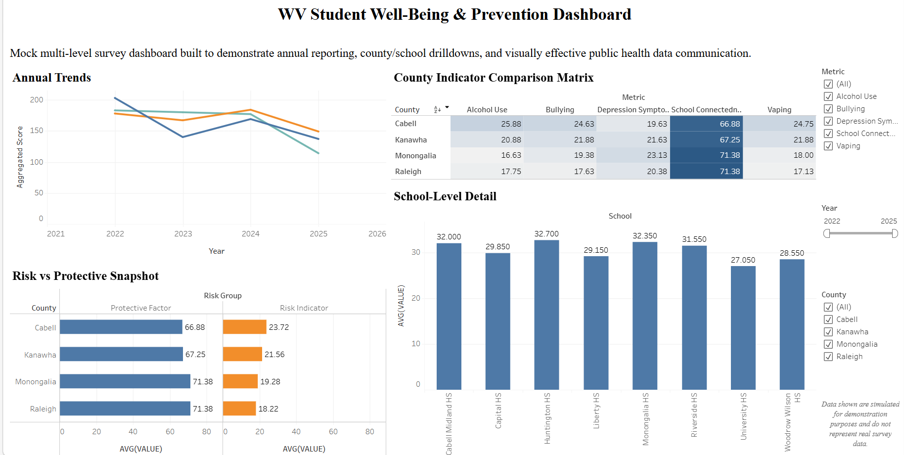

# WV Student Well-Being Prevention Dashboard

This project showcases an interactive Tableau dashboard built to analyze mock student well-being survey data and present key trends in a clear and user-friendly format.

## Project Overview
The goal of this project was to organize, prepare, and visualize survey data related to student well-being. Python was used for data preparation and structuring, and Tableau was used to build the final interactive dashboard.

## Tools Used
- Python
- Tableau
- Survey Data Analysis
- Data Cleaning
- Data Visualization

## Key Highlights
- Prepared and structured data using Python
- Built an interactive Tableau dashboard
- Designed visualizations to make trends easier to understand
- Focused on clear storytelling and user-friendly exploration

## Tableau Dashboard
[View the Tableau Public Dashboard](https://public.tableau.com/views/WVPRC_Mock_Survey_Data_TableauDasboard/WVStudentWell-BeingPreventionDashboard)

## Note
This dashboard uses mock survey data for portfolio and demonstration purposes.
